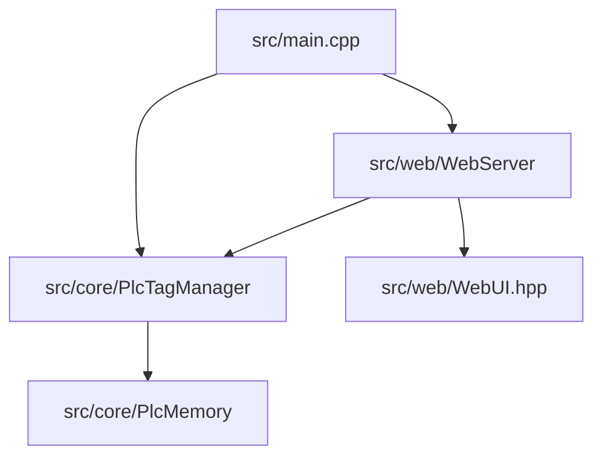

# 가상 PLC (vPLC) 내장형 경량 메모리 할당 & 맵핑 웹 대시보드 구현 계획

C++ 가상 PLC 런타임 엔진에 싱글 헤더 기반의 경량 HTTP API 서버를 내장하고, 브라우저를 통해 동적으로 메모리 태그를 생성, 관리, 강제 수정(Force Write) 및 맵핑할 수 있는 프리미엄 내장형 웹 대시보드(Embedded Web Dashboard)를 추가합니다.

---

## 💎 핵심 아키텍처 및 디자인 컨셉
* **제로 의존성 (Embedded-friendly)**: 3rd-party 라이브러리인 `cpp-httplib` 및 `nlohmann/json`을 헤더 파일 형태로 프로젝트 소스에 직접 포함하여, 추가적인 라이브러리 설치 필요 없이 C++17 빌드가 가능하게 합니다.
* **완전 내장형 웹 리소스**: HTML, CSS, JS 소스코드를 C++ Raw String Literal 형태의 헤더(`src/web/WebUI.hpp`)로 변환하여 컴파일합니다. 단일 바이너리(`vPlc`) 배포 시 추가 파일 복사가 필요 없는 임베디드 완성도를 보여줍니다.
* **프리미엄 네온 다크 모드 (Aesthetics)**: 메인 테마는 세련된 HSL 다크 모드(Deep Slate Gray, Neon Blue/Emerald Accent)와 글래스모피즘(Glassmorphism)을 적용하여 현대적이고 프로페셔널한 인상을 남깁니다.

---

## 🛠️ 주요 변경 파일 및 신규 구조

### [Component: 3rdparty Headers]
외부 의존성을 없애기 위해 널리 검증된 헤더 온리 라이브러리 2종을 `src/3rdparty/` 디렉토리에 추가합니다.
* #### [NEW] [httplib.h](file:///Users/in-youngjin/Documents/personal/vPlc/src/3rdparty/httplib.h)
  * 싱글 헤더 기반 초경량 HTTP 멀티스레드 서버 라이브러리
* #### [NEW] [json.hpp](file:///Users/in-youngjin/Documents/personal/vPlc/src/3rdparty/json.hpp)
  * 최상급 C++ JSON 직렬화/역직렬화 라이브러리

### [Component: Dynamic Tag Management]
메모리에 동적으로 명칭(Name), 주소(Address), 타입(Type)을 맵핑하는 규칙과 영구 저장을 담당합니다.
* #### [NEW] [PlcTagManager.hpp](file:///Users/in-youngjin/Documents/personal/vPlc/src/core/PlcTagManager.hpp) / [PlcTagManager.cpp](file:///Users/in-youngjin/Documents/personal/vPlc/src/core/PlcTagManager.cpp)
  * 사용자가 추가한 동적 태그(예: `ConveyorSpeed`, `HoldingRegister`, address `10`, type `INT`) 정보를 `tags.json` 파일로 저장 및 복구(Persistence)하는 엔진.
  * `PlcMemory`의 4대 영역 데이터에 접근하여 값을 바인딩하고, 실시간 강제 조작(Force Write) 및 조회 API 연결을 보장.

### [Component: Web Server & GUI Client]
웹 클라이언트 자산을 정의하고 HTTP API 엔드포인트를 서비스하는 웹 서버 엔진입니다.
* #### [NEW] [WebUI.hpp](file:///Users/in-youngjin/Documents/personal/vPlc/src/web/WebUI.hpp)
  * 완성도 높은 HTML, CSS, JS 소스코드 전체를 C++ Raw String Literal로 관리하여 헤더로 보관.
  * 반응형 디자인, 실시간 모니터링 폴링 루프, 태그 CRUD 폼, 제어 스위치 및 수치 강제 입력 슬라이더 포함.
* #### [NEW] [WebServer.hpp](file:///Users/in-youngjin/Documents/personal/vPlc/src/web/WebServer.hpp) / [WebServer.cpp](file:///Users/in-youngjin/Documents/personal/vPlc/src/web/WebServer.cpp)
  * `httplib::Server` 객체를 래핑하여 별도 스레드로 기동.
  * API 엔드포인트 바인딩:
    * `GET /`: 내장 웹 UI 서비스 (`WebUI.hpp` 문자열 반환)
    * `GET /api/tags`: 현재 등록된 전체 동적 태그 및 실시간 값 목록 조회
    * `POST /api/tags`: 신규 태그 등록 (영구 저장 파일에 반영)
    * `DELETE /api/tags`: 태그 제거
    * `POST /api/tags/write`: 특정 태그의 데이터 강제 쓰기 (Force Write)
    * `GET /api/system`: PLC 시스템 상태 (스캔 지연 시간, 가동 모드 등)

### [Component: Build & Integration]
* #### [MODIFY] [CMakeLists.txt](file:///Users/in-youngjin/Documents/personal/vPlc/CMakeLists.txt)
  * 헤더 검색 경로(`src/3rdparty`) 추가 및 새로 생성한 소스 파일(`PlcTagManager.cpp`, `WebServer.cpp`) 컴파일 대상에 추가.
* #### [MODIFY] [main.cpp](file:///Users/in-youngjin/Documents/personal/vPlc/src/main.cpp)
  * CLI 옵션에 `--web [port]` 및 `-w [port]` 옵션 추가 (기본 웹 서버 포트: `8080`).
  * `PlcTagManager`와 `WebServer` 객체를 생성하고 백그라운드 스레드로 기동/그레이스풀 종료(Graceful Shutdown) 처리.

---

## 🧪 검증 계획 (Verification Plan)

### 수동 검증 및 동작 테스트
1. **웹 API 서버 단독 응답 검증**:
   * vPLC 빌드 후 기동: `./vPlc --web 8080`
   * 터미널에서 API 테스트: `curl http://localhost:8080/api/tags`
2. **동적 태그 할당 및 맵핑 검증**:
   * 브라우저(`http://localhost:8080`)에 접속하여 프리미엄 대시보드 화면 확인.
   * `Tag Name: TankLevel`, `Area: HoldingRegisters`, `Address: 5`, `Type: UINT16`를 추가.
   * `tags.json` 파일에 해당 태그가 즉시 기록되는지 영구 보존성 테스트.
3. **실시간 강제 조작(Force Write) 연동 검증**:
   * 대시보드에서 `TankLevel`의 값을 강제로 `450`으로 설정.
   * vPLC TUI 대시보드 및 Modbus/S7comm 클라이언트를 통해 실제 `HoldingRegister[5]` 번지의 값이 `450`으로 정상 변동하는지 교차 확인.
