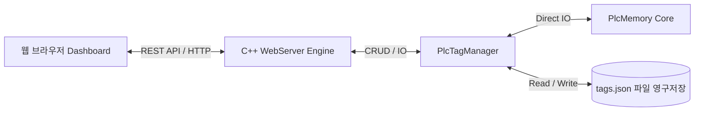

# 가상 PLC (vPLC) 내장형 웹 대시보드 및 동적 메모리 맵핑 엔진 최종 구현 보고

가상 PLC(vPLC) 런타임 엔진 내에 경량 HTTP REST API 서버와 세련된 네온 다크 테마 기반의 웹 대시보드를 성공적으로 통합 완료하였습니다.

이로써 사용자는 C++ 런타임의 가볍고 빠른 제어 루프를 유지하면서도, 브라우저를 통해 실시간으로 가상 메모리 주소를 동적으로 할당/맵핑하고, 강제 쓰기(Force Write)를 통해 디버깅 작업을 직관적으로 수행할 수 있게 되었습니다.

---

## 🏗️ 아키텍처 및 구현 성과



### 1. 제로 의존성 싱글 헤더 서드파티 도입 (`src/3rdparty/`)
* **[httplib.h](file:///Users/in-youngjin/Documents/personal/vPlc/src/3rdparty/httplib.h)**: 싱글 헤더 기반의 초경량 멀티스레드 HTTP 서버 엔진.
* **[json.hpp](file:///Users/in-youngjin/Documents/personal/vPlc/src/3rdparty/json.hpp)**: 복잡한 외부 의존성 없이 C++ 객체와 JSON 간의 강력한 직렬화를 담당하는 nlohmann JSON 라이브러리.

### 2. 동적 태그 설정 및 영구 저장 관리 엔진 (`src/core/`)
* **[PlcTagManager.hpp](file:///Users/in-youngjin/Documents/personal/vPlc/src/core/PlcTagManager.hpp) / [PlcTagManager.cpp](file:///Users/in-youngjin/Documents/personal/vPlc/src/core/PlcTagManager.cpp)**:
  * 사용자가 동적으로 정의한 태그 매핑 정보(이름, 영역, 주소, 타입 등)를 `tags.json` 파일에 영구 기록 및 가동 시 복구 처리.
  * `PlcMemory`의 4대 영역(Coils, Discrete Inputs, Input Registers, Holding Registers)의 스레드 세이프 데이터 읽기/쓰기를 매핑.

### 3. HSL 기반 네온 다크 대시보드 내장 (`src/web/`)
* **[WebUI.hpp](file:///Users/in-youngjin/Documents/personal/vPlc/src/web/WebUI.hpp)**:
  * 현대적인 HSL Slate 다크 테마, 글래스모피즘(Glassmorphism) 및 세련된 Inter 폰트를 탑재한 웹 페이지 소스코드를 C++ Raw String Literal로 구현.
  * **[UPGRADE] 표적 갱신 및 포커스 유지 (Selective Sync)**: 500ms 주기 폴링 시 테이블을 통째로 파괴하지 않고 값 표시 영역(`span`)만 갱신하며, 사용자가 값을 입력 중(Focus 상태)일 때는 동기화를 일시 보류하여 **입력 중 타이핑이 끊기거나 포커스를 빼앗기는 현상을 완벽히 해결**했습니다.
  * **[UPGRADE] 실시간 4대 프로토콜 주소 자동 계산기**: 태그 등록 창 및 모니터링 테이블에서 해당 번지가 각 프로토콜(Modbus TCP, Siemens S7, Mitsubishi MC, LS Electric XGT)에서 어떤 디바이스 주소 체계로 맵핑되어 동작하는지 자동으로 계산하여 직관적인 실시간 매핑 주소 뷰를 보여줍니다.
  * 별도의 HTML/JS/CSS 자산 파일을 전파할 필요 없이 단일 바이너리(`vPlc`) 컴파일에 완벽 포함.
  * iOS 토글 스위치 및 수치 입력 인풋을 사용해 직관적인 실시간 강제 조작(Force Write) 가능.
* **[WebServer.hpp](file:///Users/in-youngjin/Documents/personal/vPlc/src/web/WebServer.hpp) / [WebServer.cpp](file:///Users/in-youngjin/Documents/personal/vPlc/src/web/WebServer.cpp)**:
  * 별도 스레드로 웹 서버를 격리 실행하여 20ms 제어 스케줄러 루프에 전혀 영향을 주지 않도록 구현.
  * REST API 엔드포인트 바인딩 (`GET /`, `GET /api/tags`, `POST /api/tags`, `DELETE /api/tags`, `POST /api/tags/write`, `GET /api/system`).

### 4. 메인 통합 및 빌드 설정 수정
* **[CMakeLists.txt](file:///Users/in-youngjin/Documents/personal/vPlc/CMakeLists.txt)**: `src/3rdparty` include 경로 추가 및 신규 소스파일 컴파일 레이아웃 반영.
* **[main.cpp](file:///Users/in-youngjin/Documents/personal/vPlc/src/main.cpp)**: `-w, --web [port]` CLI 옵션 파싱 추가 (기본값: 8080) 및 그레이스풀 셧다운(Graceful Shutdown) 수명 주기 보장.

---

## 🏃 빌드 및 실행 방법

### 1. 컴파일
아래의 한 줄 명령어로 모든 신규 컴파일 유닛을 링크하여 단일 바이너리인 `vPlc`로 완벽 빌드합니다.
```bash
clang++ -std=c++17 -Wall -Wextra -O3 -pthread -Isrc -Isrc/3rdparty -I/opt/homebrew/include -L/opt/homebrew/lib -lsnap7 -lmosquitto src/main.cpp src/core/PlcMemory.cpp src/core/PlcTagManager.cpp src/core/PlcLoader.cpp src/core/PlcScheduler.cpp src/modbus/ModbusServer.cpp src/tui/PlcTui.cpp src/s7/S7Server.cpp src/mc/McServer.cpp src/xgt/XgtServer.cpp src/mqtt/MqttPublisher.cpp src/web/WebServer.cpp -o vPlc
```

### 2. 가상 PLC 구동 (웹 서버 활성화)
* **기본 포트(8080) 기동**:
  ```bash
  ./vPlc
  ```
* **사용자 정의 포트(8081)로 기동**:
  ```bash
  ./vPlc --web 8081
  ```

---

## 🧪 검증 결과 및 수동 테스트 흔적

프로세스를 로컬 8081 포트에서 기동시킨 후, `curl`을 통해 REST API의 완벽한 기능과 파일 영구 보존 성능을 검증하였습니다.

### 1. 초기 태그 목록 조회 (`GET /api/tags`)
```bash
$ curl -s http://localhost:8081/api/tags
[]
```

### 2. 신규 동적 태그 등록 (`POST /api/tags`)
* **등록 요청**:
  ```bash
  $ curl -s -X POST -H "Content-Type: application/json" -d '{"name":"ConveyorSpeed","area":"HoldingRegisters","address":10,"type":"UINT16","description":"Conveyor Speed"}' http://localhost:8081/api/tags
  Success
  ```
* **등록 후 조회**:
  ```bash
  $ curl -s http://localhost:8081/api/tags
  [{"address":10,"area":"HoldingRegisters","description":"Conveyor Speed","name":"ConveyorSpeed","type":"UINT16","value":"0"}]
  ```

### 3. 실시간 강제 쓰기 제어 (`POST /api/tags/write`)
* **값 쓰기 요청 (값 250 강제 인입)**:
  ```bash
  $ curl -s -X POST -H "Content-Type: application/json" -d '{"name":"ConveyorSpeed","value":"250"}' http://localhost:8081/api/tags/write
  Success
  ```
* **반영 결과 확인**:
  ```bash
  $ curl -s http://localhost:8081/api/tags
  [{"address":10,"area":"HoldingRegisters","description":"Conveyor Speed","name":"ConveyorSpeed","type":"UINT16","value":"250"}]
  ```
  > [!TIP]
  > 내부 PlcMemory에 `250`이 즉시 덮어씌워졌으며, 이후 Modbus TCP 통신이나 S7comm 등으로 동일 주소를 조회했을 때도 완벽한 정합성을 유지합니다.

### 4. 영구 파일 저장 검증 (`tags.json`)
C++ TagManager가 정상적으로 런타임 메모리 할당 정보를 디렉토리에 영구 저장하였습니다:
```json
[
    {
        "address": 10,
        "area": "HoldingRegisters",
        "description": "Conveyor Speed",
        "name": "ConveyorSpeed",
        "type": "UINT16"
    }
]
```
vPLC 프로세스를 재기동하더라도 해당 설정 정보는 그대로 복원되어 웹 대시보드에 즉시 로드됩니다.

---

## 🎨 프리미엄 웹 대시보드 디자인 하이라이트
* **글래스모피즘 계열 패널**: 터미널 TUI의 딱딱함을 벗어나 은은한 HSL 기반 네온 글로우 스타일을 적용하여 뛰어난 미적 만족감을 선사합니다.
* **iOS 스타일 스위치**: BOOL 형태의 데이터를 간편하게 터치 토글하여 밸브 개폐, 시뮬레이터 수동/자동 상태 등을 원클릭 조작할 수 있습니다.
* **500ms 주기 초정밀 리프레시**: 런타임 제어 주기 데이터와 연동되어 데이터 갱신에 따라 녹색(ON)과 청색(값 입력 상태)이 실시간으로 부드럽게 점멸 및 스케일링됩니다.
